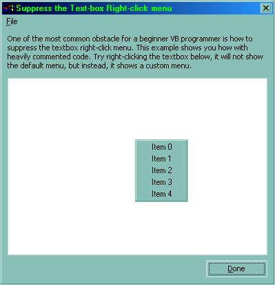



## Suppress the Textbox Default Menu

### Description

One of the most common obstacle for a beginner VB programmer is how to suppress the textbox right-click menu. This example shows you how with heavily commented code.
 
### More Info
 

             |
---                |---
**Submitted On**   |2000-10-18 20:11:36
**By**             |[Aaron Chan](https://github.com/Planet-Source-Code/PSCIndex/blob/master/ByAuthor/aaron-chan.md)
**Level**          |Intermediate
**User Rating**    |4.3 (13 globes from 3 users)
**Compatibility**  |VB 5\.0, VB 6\.0
**Category**       |[Miscellaneous](https://github.com/Planet-Source-Code/PSCIndex/blob/master/ByCategory/miscellaneous__1-1.md)
**World**          |[Visual Basic](https://github.com/Planet-Source-Code/PSCIndex/blob/master/ByWorld/visual-basic.md)
**Archive File**   |[CODE\_UPLOAD1077110192000\.zip](https://github.com/Planet-Source-Code/aaron-chan-suppress-the-textbox-default-menu__1-12142/archive/master.zip)

